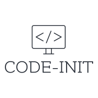

# Code-Init



Initialize your competitive programming template after reading the problems, complete with the details of the problem and any asset needed from the problem.

Currently supports: 
1. [uhunt](https://uhunt.onlinejudge.org/). 
2. [ProjectEuler.net](https://projecteuler.net/)

Future updates might include other sites.

## Getting Started

### Prerequisites

1. Install [ghostscript](https://www.ghostscript.com/download.html), and choose the PDF interpreter/renderer.
2. Have **Python** v3.0 above installed on your machine. Check your version by calling `python --version` in terminal
3. Do install the same version as your **Python** (Install 32 bit **ghostscript** if your Python is also 32 bit)

### Installing

#### Activating Virtual Env
```bash
python -m venv env
env/Scripts/activate # If you're on windows or
env/bin/activate    # If you're on UNIX
```

#### Dependencies & Running
```bash
git clone https://github.com/T-kON99/code-init code-init
pip install -r requirements.txt
cd code-init
python code-init.py -help
```

### Usage

> Initiate uhunt problem 787 as a python file
```bash
python code-init.py -n 787 --lang py -p uhunt
```
> Force overwrite existing file, by default it will skip the file if it exists
```bash
python code-init.py -n 22 --lang py -p projecteuler -f
```

### Footnotes

- All assets related to the problems will be fetched and saved under      location `./assets`. Configurable based on `./config/config.json`
- Code file will be generated based from `./config/config.json`, configurable.
- Tested with `ghostscript v9.50` and below until `v8.x`
- Enjoy and happy hunting!
